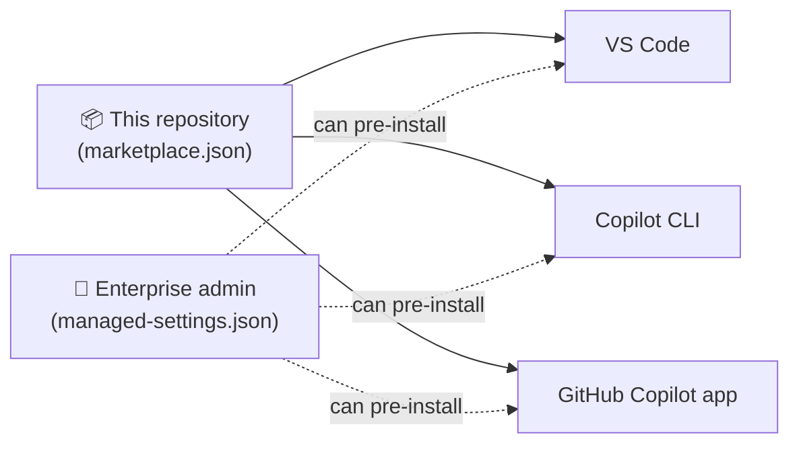
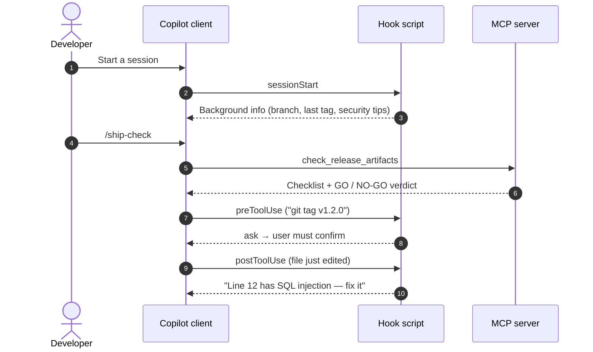

# Architecture

This page explains how the plugins are put together and how they run. It's for plugin authors, maintainers, and reviewers. To install or use the plugins, see the [installation guide](installation.md) instead.

**On this page**

1. [The short version](#the-short-version)
2. [Key terms](#key-terms)
3. [What's inside a plugin](#whats-inside-a-plugin)
4. [How a plugin reaches each client](#how-a-plugin-reaches-each-client)
5. [What happens when you use a plugin](#what-happens-when-you-use-a-plugin)
6. [How the code is organized](#how-the-code-is-organized)
7. [Design decisions](#design-decisions)

## The short version

- The repository is a **marketplace**: a catalog that Copilot clients read to find the plugins.
- Each of the three plugins is a **folder** with a `plugin.json` file. There's nothing to build or compile.
- Every plugin has the same five building blocks: a **skill**, an **MCP server**, a **custom agent**, **hooks**, and a **slash command**. VS Code also gets an **automation template**.
- The skill and the MCP server follow an **open standard** (Agent Plugins 1.0), so any compatible AI tool can use them. The agent, hooks, and command are **Copilot-only** extras kept in their own folder.
- Everything runs locally with **Node.js**, with no downloads, dependencies, or network calls.

## Key terms

| Term | Meaning |
|---|---|
| **Plugin** | A folder that bundles Copilot customizations so they can be installed, versioned, and removed as one unit |
| **Marketplace** | A Git repository with a `marketplace.json` file that lists plugins. Clients add it once, then install plugins from it |
| **Client** | The app that runs Copilot: VS Code, Copilot CLI, or the GitHub Copilot app |
| **Skill** | A `SKILL.md` file with step-by-step instructions, plus optional scripts. Copilot loads it when a request matches its description |
| **MCP server** | A small program that gives Copilot extra tools, such as "check release readiness." It talks to Copilot over standard input and output (stdio) |
| **Custom agent** | A named persona (`*.agent.md`) with its own instructions and a limited set of tools |
| **Hook** | A script that Copilot runs at set moments, like session start or before a tool runs. Hooks can add context or allow, ask, or deny an action |
| **Slash command** | A saved prompt you run by typing `/name` |
| **Automation template** | A saved prompt with a schedule. VS Code only |

## What's inside a plugin

Every plugin folder has the same layout. `secure-code` is shown here:

```text
plugins/secure-code/
│
├── plugin.json                  ① Name, version, description (required)
│
├── skills/secure-code-review/   ② Skill               ┐ Open standard:
├── mcp.json                     ③ MCP server config   ┘ works in any compatible client
├── servers/                        └─ MCP server code (vuln-scout)
│
├── com.github.copilot/          ④ Copilot-only extras:
│   ├── agents/                     └─ custom agent (security-guardian)
│   ├── commands/                   └─ slash command (/security-scan)
│   └── hooks/hooks.json            └─ hook config → scripts/hooks/
├── scripts/hooks/                  └─ hook code
│
└── automations/                 ⑤ VS Code automation template
```

| # | Part | Who reads it |
|---|---|---|
| ① | `plugin.json` | Every client. It identifies the plugin |
| ② ③ | Skill and MCP server | Every client that supports the Agent Plugins standard |
| ④ | `com.github.copilot/` | Copilot clients only. Other tools skip this folder |
| ⑤ | `automations/` | VS Code only |

Because the locations are fixed by the standard, `plugin.json` doesn't list components. Clients look for them by folder name.

## How a plugin reaches each client



1. A user, or an enterprise admin, adds this repository as a marketplace.
2. The client reads `.github/plugin/marketplace.json` to see the three plugins.
3. Installing a plugin copies its folder to the client's plugin directory. The user doesn't need to do anything else.
4. VS Code also picks up plugins installed with Copilot CLI automatically.

## What happens when you use a plugin

This example follows a typical session with **ship-ready** and **secure-code** installed.



| Step | What happens | Why it matters |
|---|---|---|
| 1–3 | At session start, hooks give Copilot short background information about the repository | Copilot starts with useful context before you ask anything |
| 4–6 | The slash command loads the skill, and the skill tells Copilot which MCP tools to call | Answers are based on real data from your repository, not guesses |
| 7–8 | Before a risky command runs, a hook decides to **allow** it, **ask** you, or **deny** it | Guardrails that don't depend on the model making the right choice |
| 9–10 | After a file is edited, a hook scans the change and reports problems back to Copilot | Copilot fixes its own mistakes right away |

**If a hook fails, work continues.** Every hook catches its own errors and returns "no decision." A bug in a hook never blocks your work. Only deliberate security rules, such as blocking a leaked secret, can deny an action.

## How the code is organized

### One core module per plugin

Each plugin puts its main logic in one place. The MCP server, the hooks, and the skill's script all call that same module, so they always give the same answers.

| Plugin | Core module(s) | Used by |
|---|---|---|
| ship-ready | `servers/release-radar-core.mjs` | `release-radar` MCP server · release guard hook · `readiness-report.mjs` |
| secure-code | `servers/security-rules.mjs`, `scanner.mjs`, `dependency-audit.mjs` | `vuln-scout` MCP server · security guard hook · `scan.mjs` |
| onboarding-buddy | `servers/atlas-core.mjs` | `repo-atlas` MCP server · welcome hook · `check-toolchain.mjs` |

### Shared code is copied, not linked

The standard requires each plugin to be **self-contained**: a plugin can't reference files outside its own folder. Code that all three plugins need is kept once in [`shared/`](../shared) and copied into each plugin.

| Shared file | Copied into | What it does |
|---|---|---|
| `mcp-stdio.mjs` | `plugins/*/servers/lib/` | Runs an MCP server with no external libraries |
| `workspace.mjs` | `plugins/*/servers/lib/` | Finds the repository, reads files safely, and runs `git` |
| `hook-io.mjs` | `plugins/*/scripts/hooks/lib/` | Reads hook input from any client and writes output every client understands |

After you edit `shared/`, run `npm run sync`. CI fails if a copy is out of date.

### One hook script works in every client

Clients send hook data in slightly different formats. `hook-io.mjs` hides those differences:

| | Copilot CLI and Copilot app | VS Code |
|---|---|---|
| Tool name field | `toolName` | `tool_name` |
| Tool input field | `toolArgs` | `tool_input` |
| Where the decision goes | Top level of the output | Inside `hookSpecificOutput` |

The hook reads either input format and writes both output formats, so each client finds the fields it expects. See the [compatibility matrix](compatibility-matrix.md) for the full list of differences.

## Design decisions

| We chose | Instead of | Because |
|---|---|---|
| The **Agent Plugins 1.0** format | The older Copilot-only plugin format | GitHub recommends it for new plugins, and the skill and MCP server work in other AI tools too |
| MCP servers with **no dependencies** | The official MCP SDK installed with `npm` | Nothing to install, it works offline and behind proxies, it starts instantly, and there's no third-party code to audit |
| **Node.js** for hooks | Separate bash and PowerShell scripts | One implementation for macOS, Linux, and Windows, using the same runtime as the MCP servers |
| The **Copilot hook format** (`"version": 1`, camelCase event names) | The VS Code-style format (PascalCase) | Copilot CLI and the app use it natively, and VS Code converts it. Mixing both formats in one file makes the CLI run each hook twice |
| **Offline** security rules | Calling vulnerability APIs online | No data leaves the machine and scans are fast enough to run after every edit. GitHub code scanning, Dependabot, and secret scanning remain the source of truth |
| **One** skill, agent, and command per plugin | Many small skills | Easier to understand and demo. The skill holds the workflow, and the agent and command reuse it |
