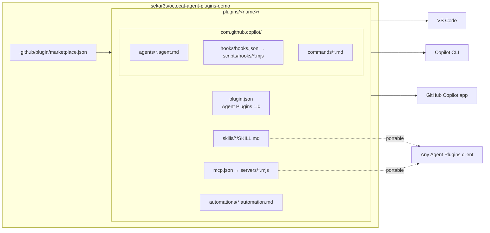
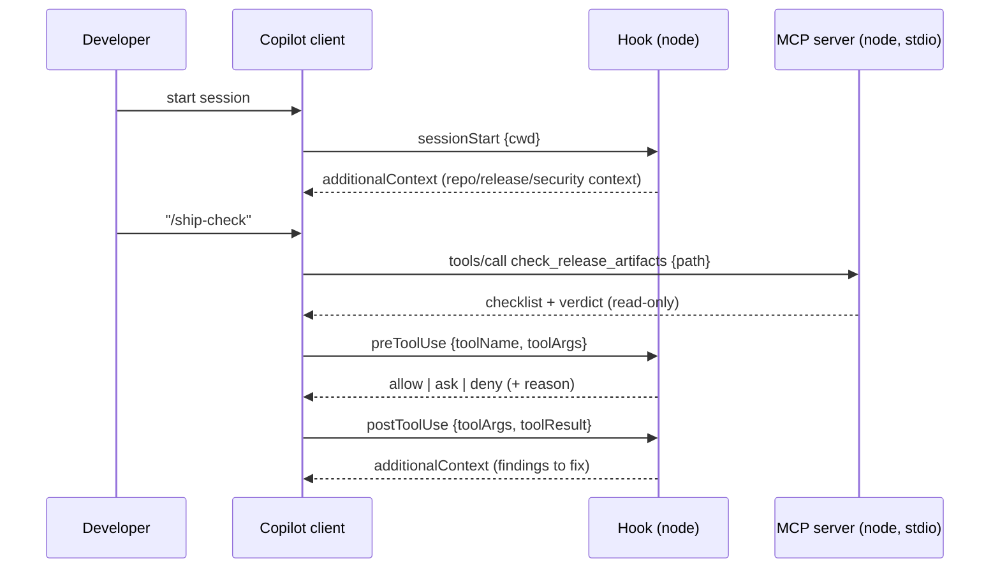

# Architecture

## Package model

- **Portable core** (Agent Plugins 1.0 §6): `skills/` and `mcp.json`, found at fixed locations. The manifest can't point elsewhere.
- **Client extension** (§8): `com.github.copilot/` holds Copilot-only components. Other clients ignore it.
- **VS Code extra:** `automations/` at the plugin root.

## Runtime flow

## Shared code

Plugins must be self-contained: package paths can't resolve outside the plugin root (spec §4). Shared code lives once in [`shared/`](../shared) and is **copied** into each plugin:

| Source | Copied to | Purpose |
|---|---|---|
| `shared/servers/lib/mcp-stdio.mjs` | `plugins/*/servers/lib/` | Zero-dependency MCP server: protocol negotiation, `tools/list`, `tools/call`, `roots/list`, error mapping |
| `shared/servers/lib/workspace.mjs` | `plugins/*/servers/lib/` | Workspace resolution, safe file reads, git helpers |
| `shared/hooks/lib/hook-io.mjs` | `plugins/*/scripts/hooks/lib/` | Payload normalization, dual-shape outputs, fail-open runner, opt-in audit |

Run `npm run sync` after editing `shared/`. CI fails if the copies drift (`npm run sync:check`).

Each plugin keeps its domain logic in one core module (`release-radar-core.mjs`, `security-rules.mjs` + `scanner.mjs` + `dependency-audit.mjs`, `atlas-core.mjs`). The MCP server, the hook, and the skill script all use it, so the three interfaces always agree.

## Why these choices

| Decision | Alternatives considered | Rationale |
|---|---|---|
| Agent Plugins 1.0 format | Legacy Copilot format (`agents/`, `.mcp.json`) | GitHub recommends it for new plugins; skills and MCP are portable beyond Copilot |
| Zero-dependency stdio MCP servers | `@modelcontextprotocol/sdk` via `npx` or `${PLUGIN_DATA}` install | No install step, works offline and behind proxies, nothing to audit beyond this repository, instant startup |
| Node.js for hooks | bash + PowerShell scripts | One implementation for every OS; the same runtime as the MCP servers |
| Copilot hook format (`version: 1`, camelCase) | VS Code-native PascalCase | Native to CLI/app; mapped by VS Code; mixing both formats double-fires in the CLI |
| Offline heuristics in secure-code | Calling OSV/GitHub Advisory APIs | No data egress; fast enough for `postToolUse`; GitHub-native scanning stays the source of truth |
| One skill + one agent + one command per plugin | Many small skills | Clearer demo; the skill carries the workflow and the agent/command reuse it |
